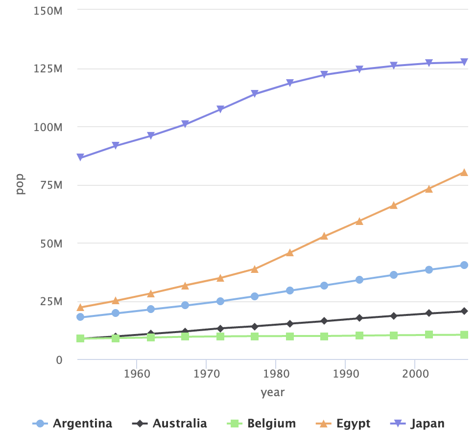

## 前言  
`Highcharts`是一個基於 `Javascript`編寫的圖表套件，能夠簡單、快速並且免費的提供網站的互動性圖表。而`R`語言中的`highcharter`套件提供在了基於`R`來運用`Highcharts`進行資料視覺化與可互動圖表的製作，在統計、流行病學進行分析及視覺化方面提供了更為多元、優化的選擇。  
<!--more-->
## 基本語法

```R
# Install & load packages
install.packages("highcharter")
library(dplyr) # to use ethe pipe-operator
library(highcharter)

highchart() %>% 
    hc_add_series(name = "資料名稱", data = y軸) %>%
    hc_xAxis(categories = x軸)
```
以上是一個泛用的`highcharter`基本語法，當然在套件也提供了一個更簡便（當然可調整選項更少）的語法：

```R
hchart(data, "圖表類型", hcaes(x = x軸, y = y軸, group = 分組))
```
若不需要太多的調整，僅要單純繪製出圖表，相信以此基礎語法便以足夠了。以下會詳細的來介紹各式圖表語法的使用及繪製。
 
## 折線圖
```R
library(dplyr)
library(highcharter)
library(gapminder)

data(gapminder)
data.vis <- gapminder %>% subset(country %in% c("Australia", "Belgium", "Japan", "Argentina", "Egypt"))
hchart(data.vis, "line", hcaes(x = year, y = pop, group = country))
```




## 散佈圖
## 長條圖

## 圓餅圖 
