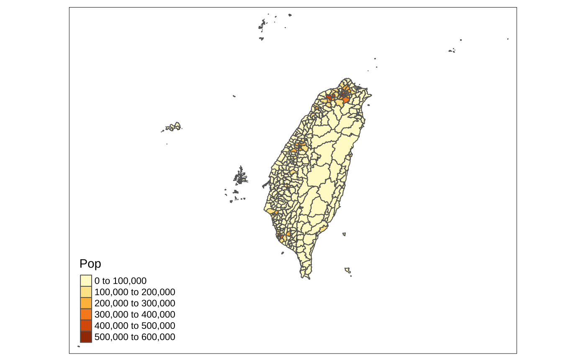
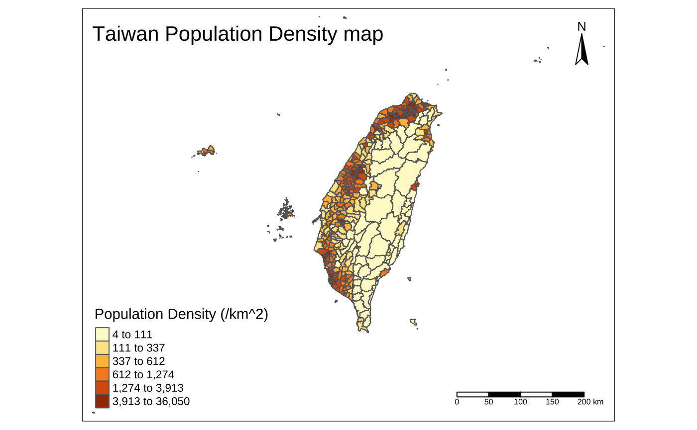

111-2學期地理系必修⟪空間分析⟫上課內容整理。
<!--more-->

---
## 空間資料處理

### 空間資料

在R當中，空間資料能夠以`sf`（Simple Feature for R）格式進行儲存，其分為兩部分資訊，分別代表「空間」及「屬性」。「屬性」為該資料框架（Data frame）之要素的屬性資訊，而「空間」則代表幾何資訊，由一個list組成，每一個`sfc`（Simple Feature Geometry List-column）儲存資料向量中所有的幾何資訊，每個元素都代表一個幾何元素，也就是`sfg`（Simple Feature Geometry）。


```R
library(sf)
# 讀入shp檔案
data <- st_read("data.shp", options = "ENCODING=BIG-5", quiet = T)
# 空間
data$geometry
st_geometry(data)
# 屬性
st_drop_geometry(data)
# 座標系統
st_crs(data)
# 面積
AREA <- st_area(data)
# 單位轉換（以面積為例）
set_units::set_units(AREA, km^2)
```

### 地圖繪製

空間資料多半需要進行視覺化以便讀者能夠快速獲取重點資訊，以利判斷。R有多種繪製圖表的套件，多半支援地圖的繪製，如內建的`plot()`函數、`ggplot2`套件等，我們在此主要使用`tmap`進行地圖繪製。以下的程式碼是使用`tmap`進行繪製的一個範例程式碼。

```R
library(tmap)
tm_shape(data) + tm_polygons("欄位") + tm_layout()
```

以下提供幾個範例供參考：

**Polygons**
```R
Popn_TWN2 <- st_read("Data/Popn_TWN2/Popn_TWN2.shp", options = "ENCODING=BIG-5") %>% 
  mutate(POP = A0A14_CNT + A15A64_CNT + A65UP_CNT)
tm_shape(Popn_TWN2) + tm_polygons("POP")
```


**Borders**
```R
```

**Lines**
```R
```

**Dots**
```R
```

**Symbols**
```R
```

**範例：繪製台灣鄉鎮人口密度，含圖例、比例尺、圖名和指北針的面量圖，並按照Quantile分成6級**
```R
# Calculate the population density
Popn_TWN2$P_DENSITY <-  Popn_TWN2$POP / units::set_units(st_area(Popn_TWN2), km^2)
# break
breakv <- getBreaks(v = Popn_TWN2$P_DENSITY, nclass = 6, method = "quantile")
# Tmap
tm_shape(Popn_TWN2) + 
  tm_polygons("P_DENSITY", title = "Population Density (/km^2)", breaks = breakv) + 
  tm_scale_bar(width = 0.2, position = c("right", "bottom")) + 
  tm_compass(position = c("right", "top")) + 
  tm_layout(title = "Taiwan Population Density map", title.position = c("left", "top"), title.bg.color = T)
```
